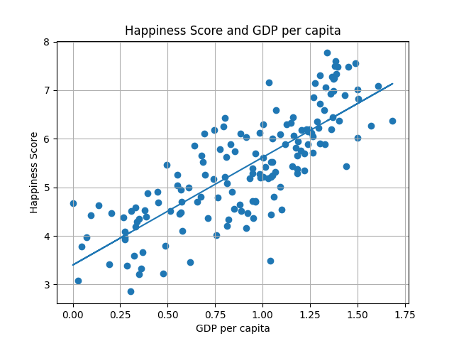
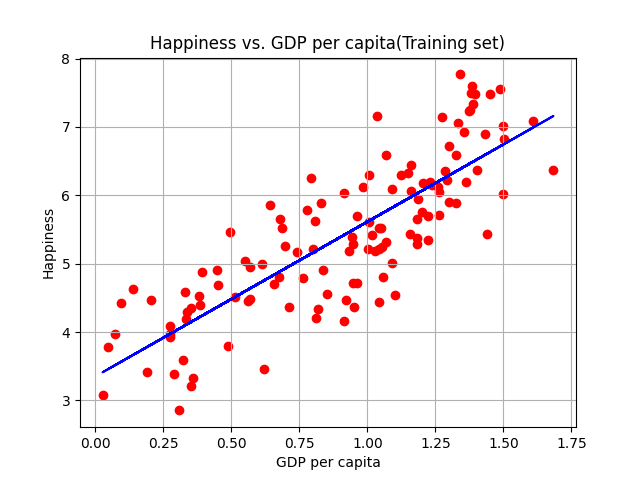

#Linear Regression Analysis
***

I performed data analysis on two data sets using python. The two datasets that 
I used are the life expectancy of countries and the Happiness score of each country.
- For the Life Expectancy dataset, I just plotted USA, Canada, and Mexico
- For the Happiness score dataset, I performed linear regression machine learning so that I can predict
the Happiness score of a country based on the GDP per capita score.
***

##Life Expectancy Data [1800-2016]

Dataset Source: https://www.kaggle.com/brendan45774/countries-life-expectancy

According to the graph, all three countries had a drastic increase in life expectancy between the years 1900 and 2000.
Canada leads in health expectancy, followed by USA then Mexico. 

***
##Country Happiness based on GDP per Capita [Year 2019]

World happiness report dataset:
https://www.kaggle.com/unsdsn/world-happiness?select=2019.csv

The gross domestic product per capita, or GDP per capita, is a measure 
of a country's economic output that accounts for its number of people. It divides the country's gross domestic product by its total population.

***

***

###Project Sources:

- https://www.w3schools.com/python/matplotlib_intro.asp  
  
- https://www.w3schools.com/python/python_ml_getting_started.asp
- https://www.youtube.com/watch?v=jEgVto5QME8&ab_channel=PenguinAnalytics
- https://www.youtube.com/watch?v=nUPQzaZQ0X0&ab_channel=SalahBenkorichi
- https://www.youtube.com/watch?v=1BYu65vLKdA&list=PLzMcBGfZo4-mP7qA9cagf68V06sko5otr&index=3&ab_channel=TechWithTim
- https://www.youtube.com/watch?v=bpdvNwvEeSE&ab_channel=HiteshChoudhary